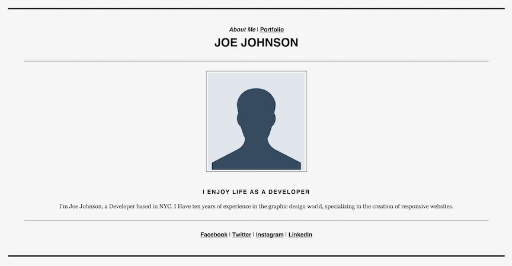
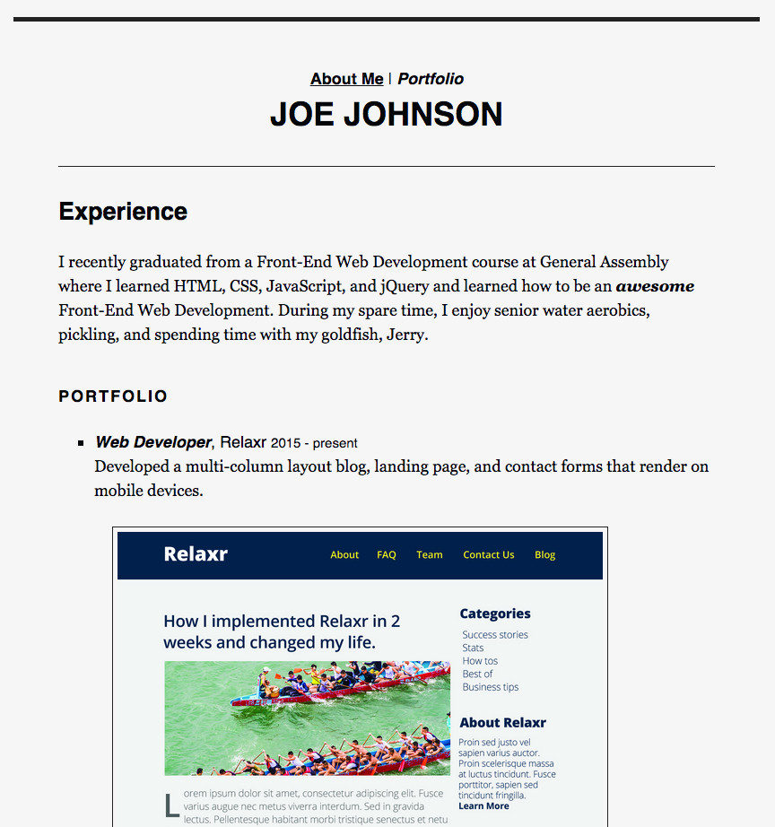

#FEWD Week #1: HTML/CSS Basics

 

---

###Description

For the first assignment, you will begin creating the beginnings of your first website. Take what you've learned from class and build a portfolio site that showcases all of the projects you'll be completing over the next few weeks. Build two pages - an 'About Page' and a 'Portfolio' - that link to one another. Your 'About Page' should describe your mission and value proposition and your 'Portfolio' should include [screenshots](images) with descriptions of the work you [will] do for Relaxr, Startup Matchmaker, and CitiPix. Don't worry if you can't come up with any text for the pages--we've provided you with [some sample copy](sample_copy.txt) that you can use.

 

---

###Real-World Applications

- Create a website with multiple pages that link together
- Style a page using CSS via an external stylesheet
- Add images to a website
- Clearly articulate your skills and experience on a landing page
- Provide customers or site visitors with important contact and social media information in a format they're accustomed to

 

---

###Technical Requirements

- Link both pages together using `a` tag
- Use a unique `title` and a single unique `h1` tag on each page
- Show images using `img` tags including unique `alt` attributes
- Use an external CSS stylesheet to style your pages
- Select at least 5 elements on the page and apply at least 5 different css properties (`font-size`, `color`, `font-family`, `background`, `text-decoration`) to these elements
- Use at least 6 different HTML tags (`h1`, `h2`, `h3`, `h4`, `h5`, `h6`, `p`, `ul`, `a`, `img`, `div`, `nav`) on your pages
- Indent nested elements to increase your code's readability

#### Bonus

- Experiment by adding additional HTML tags and CSS properties we did not cover in class - explore!

 

---

###Resources

- Slides from [class 1](http://ga-students.github.io/FEWD-DC-22/Week_01_Basics/01_html_basics/index.html) and [class 2](http://ga-students.github.io/FEWD-DC-22/Week_01_Basics/02_css_basics/index.html).

Here are examples of a simple "About" and "Portfolio" page that fulfill the assignment requirements:

- Joe, the freelance developer's "about page":

- Joe, the freelance developer's "portfolio page":

 

---

###Submission

1. Download the zip file for this repository
2. Work on it
3. Zip it back up, with the your name in the file (i.e. JacobFriedmann_Assignment1.zip)
4. Submit it to [dropbox](https://www.dropbox.com/request/KE5YRxmvEpEfwqc0JLOy)

###Evaluation

The instructional team will grade each technical requirement and provide a numeric grade on a scale: does not meet expectations (0); meets expectations (1); exceeds expectations (2).  The maximum possible score on this assignment is 14/14.

